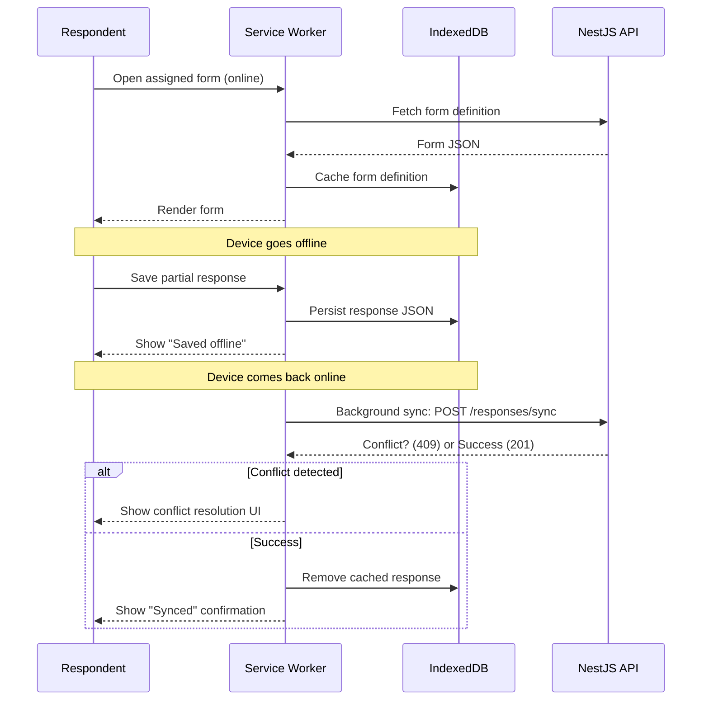
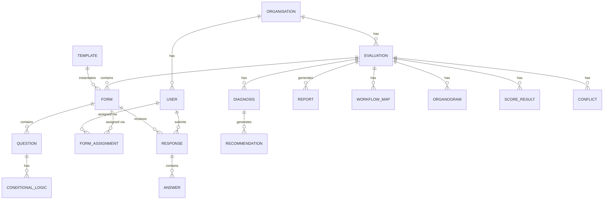

# Design Document: Pro-Insight 360

## Overview

Pro-Insight 360 is an AI-powered organisational evaluation, diagnosis, and solution recommendation platform for GIS Konsult Ltd. It enables consultants to conduct structured assessments of client organisations across four evaluation dimensions (WHO, WHAT, HOW, WHEN), aggregate multi-user responses, detect patterns and conflicts, generate AI-assisted diagnoses, and produce professional reports.

The platform is delivered as a Progressive Web Application (PWA) built on Next.js (frontend) with a NestJS backend and PostgreSQL database. AI-assisted diagnosis and recommendation generation uses a dual-provider strategy: Google Gemini Flash as the primary provider (free tier) with Groq as the fallback (free tier), giving zero AI cost under normal usage. Five user roles — Super_Admin, Consultant, Client_Admin, HOD, and Respondent — each have scoped access to platform features.

### Key Design Goals

- **Correctness**: Reliable serialisation/deserialisation of form definitions and offline responses with no data loss
- **Offline-first**: Full PWA support with local caching and conflict-aware sync
- **AI-assisted, human-approved**: All AI-generated content requires consultant review before publication
- **Universal usability**: Accessible, plain-language UI for all ages and technical backgrounds (Requirement 25)
- **Multi-tenancy**: Strict data isolation between client organisations
- **Auditability**: Immutable audit logs for all authentication, data access, and administrative events

### Infrastructure Stack (Free Tier)

| Layer | Provider | Why |
|---|---|---|
| Frontend | Vercel | Native Next.js hosting, generous free tier |
| Backend | Railway | NestJS container hosting, free tier available |
| Database | **Neon** (PostgreSQL) | Serverless PostgreSQL, free 0.5GB, no auto-pause, Git-like branching for dev/staging |
| Cache & Queue | **Upstash Redis** | Serverless Redis, free 10K commands/day, perfect for Bull job queue |
| File Storage | **Backblaze B2** | S3-compatible, free 10GB, no card required, no egress fees to Cloudflare |
| AI Primary | Google Gemini Flash | Free tier: 15 req/min, 1M tokens/min |
| AI Fallback | Groq | Free tier: fast LLaMA 3.1 inference |
| Email | Brevo | Free: 300 emails/day |

**Why Neon over alternatives:**
- Pure PostgreSQL — no vendor lock-in, works with any Postgres client or ORM (TypeORM/Prisma)
- Serverless auto-suspend saves free tier quota when idle
- Database branching lets you create isolated dev/staging environments from the same free account
- Supports the complex relational queries this platform needs (joins across 20+ tables, window functions for scoring, aggregations for conflict detection)

---

## Architecture

### High-Level Architecture

```mermaid
graph TB
    subgraph Client["Client Layer (Browser / PWA)"]
        UI["Next.js App (React)"]
        SW["Service Worker"]
        IDB["IndexedDB / Cache Storage"]
    end

    subgraph API["API Layer"]
        GW["NestJS API Gateway"]
        Auth["Auth Module (JWT + MFA)"]
        FormSvc["Form Service"]
        EvalSvc["Evaluation Service"]
        RespSvc["Response Service"]
        ScoreSvc["Score Engine"]
        AISvc["AI Engine"]
        ReportSvc["Report Generator"]
        OrgSvc["Organogram Service"]
        WorkflowSvc["Workflow Service"]
        DocSvc["Document Service"]
        AuditSvc["Audit Service"]
    end

    subgraph Data["Data Layer"]
        PG["Neon PostgreSQL (primary DB — free tier)"]
        S3["Backblaze B2 (file storage — free 10GB)"]
        Redis["Upstash Redis (sessions + job queue — free tier)"]
    end

    subgraph External["External Services"]
        Gemini["Google Gemini API (primary AI)"]
        Groq["Groq API (fallback AI)"]
        Email["Email Service (SMTP/Brevo)"]
    end

    UI <-->|HTTPS REST/WebSocket| GW
    SW <-->|Cache-first| IDB
    SW <-->|Background sync| GW
    GW --> Auth
    GW --> FormSvc
    GW --> EvalSvc
    GW --> RespSvc
    GW --> ScoreSvc
    GW --> AISvc
    GW --> ReportSvc
    GW --> OrgSvc
    GW --> WorkflowSvc
    GW --> DocSvc
    GW --> AuditSvc
    FormSvc --> PG
    EvalSvc --> PG
    RespSvc --> PG
    ScoreSvc --> PG
    AISvc --> PG
    AISvc --> Gemini
    AISvc --> Groq
    ReportSvc --> PG
    ReportSvc --> S3
    DocSvc --> S3
    Auth --> Redis
    AISvc --> Redis
    ReportSvc --> Redis
    GW --> Email
```



### Frontend Architecture

The Next.js application uses the App Router with server components for data-heavy pages and client components for interactive UI. Key frontend concerns:

- **Role-scoped layouts**: Each role gets a dedicated layout with only relevant navigation items (Requirement 25.6)
- **PWA shell**: Service worker (Workbox) handles offline caching of form structures and partial responses
- **State management**: Zustand for client-side state; React Query (TanStack Query) for server state and cache invalidation
- **Form rendering**: Dynamic form renderer driven by JSON form definitions fetched from the API
- **Drag-and-drop**: `@dnd-kit` for the form builder canvas
- **Diagrams**: React Flow for workflow maps; D3-OrgChart for organograms
- **Charts**: Recharts for dashboards (radar, bar, line charts)
- **UI components**: Shadcn UI (Radix UI primitives) + Tailwind CSS

### Backend Architecture

NestJS uses a modular monolith structure. Each domain (forms, evaluations, responses, scoring, AI, reports, etc.) is a NestJS module with its own controller, service, and repository layer. This keeps the codebase navigable while avoiding the operational overhead of microservices at this stage.

- **Authentication**: JWT access tokens (24h expiry) + refresh tokens stored in Upstash Redis; MFA via TOTP (authenticator app)
- **Background jobs**: Bull queue (backed by Upstash Redis) for async tasks: AI diagnosis generation, report generation, email dispatch, score recomputation
- **WebSocket**: Socket.IO gateway for real-time dashboard updates (Requirement 17.4)
- **File storage**: Backblaze B2 (S3-compatible, free 10GB, no card required) for reports, organogram exports, uploaded documents
- **Audit logging**: Every write operation emits an audit event to a dedicated append-only audit table

### PWA / Offline Architecture



---

## Components and Interfaces

### Frontend Components

#### Form Builder (`/consultant/forms/builder`)
- `FormBuilderCanvas` — droppable canvas; renders ordered list of `QuestionCard` components
- `QuestionPalette` — draggable question type tiles (23 types)
- `QuestionCard` — renders question config UI; emits `onUpdate`, `onDelete`, `onReorder`
- `ConditionalLogicEditor` — modal for configuring show/hide rules; validates referenced question IDs
- `FormPreviewModal` — renders the form exactly as a Respondent would see it

#### Form Renderer (`/respondent/forms/[formId]`)
- `FormRenderer` — driven by form JSON; renders questions in order, applies conditional logic
- `OfflineStatusBanner` — shows sync status (pending / syncing / synced / error)
- `ProgressIndicator` — step/page progress for multi-page forms (Requirement 25.10)

#### Dashboards
- `ConsultantDashboard` — evaluation cards, completion rates, conflict count, score summaries
- `ClientAdminDashboard` — respondent completion table, org-level score
- `HODDashboard` — department-level scores and completion status
- `RespondentDashboard` — assigned forms, completion status, sync status

#### Organogram Viewer (`/consultant/evaluations/[id]/organogram`)
- `OrgChartViewer` — wraps D3-OrgChart; supports expand/collapse, colour-by-department
- `OrgChartUploader` — CSV/JSON upload with validation feedback
- `CycleErrorAlert` — displays circular-reference error with named employees

#### Workflow Map Editor (`/consultant/evaluations/[id]/workflow`)
- `WorkflowCanvas` — React Flow canvas with custom node types (task, decision, start, end)
- `NodeInspector` — side panel for annotating nodes; marks nodes as inefficient
- `BPMNImportExport` — handles BPMN 2.0 XML import/export

#### AI Diagnosis Review (`/consultant/evaluations/[id]/diagnosis`)
- `DiagnosisReviewPanel` — inline editor for each diagnosis section
- `ApprovalToolbar` — approve / reject / request regeneration actions
- `AuditHistoryDrawer` — shows previous versions of a diagnosis

#### Report Generator (`/consultant/evaluations/[id]/reports`)
- `ReportSectionSelector` — checklist of includable sections
- `ReportGenerationStatus` — progress indicator during generation
- `ReportLibrary` — lists all generated report versions with download links

### Backend Modules and Key Interfaces

#### Auth Module
```typescript
interface AuthService {
  login(credentials: LoginDto): Promise<TokenPair>;
  refreshToken(refreshToken: string): Promise<TokenPair>;
  setupAccount(token: string, password: string): Promise<void>;
  enableMFA(userId: string): Promise<MFASetupDto>;
  verifyMFA(userId: string, code: string): Promise<boolean>;
  lockAccount(userId: string): Promise<void>;
}
```

#### Form Service
```typescript
interface FormService {
  createForm(consultantId: string, dto: CreateFormDto): Promise<Form>;
  updateForm(formId: string, dto: UpdateFormDto): Promise<Form>;
  publishForm(formId: string): Promise<Form>;
  getFormDefinition(formId: string): Promise<FormDefinition>;
  serializeForm(form: FormDefinition): string;           // → JSON string
  deserializeForm(json: string): FormDefinition;         // validates schema
  prettyPrintForm(json: string): string;                 // formatted JSON
}
```

#### Response Service
```typescript
interface ResponseService {
  submitResponse(respondentId: string, dto: SubmitResponseDto): Promise<Response>;
  syncOfflineResponse(dto: SyncResponseDto): Promise<SyncResult>;
  serializeResponse(response: ResponseData): string;
  deserializeResponse(json: string): ResponseData;       // validates schema
  quarantineResponse(raw: string, error: ValidationError): Promise<void>;
}
```

#### Score Engine
```typescript
interface ScoreEngine {
  computeDigitalReadiness(evaluationId: string): Promise<DigitalReadinessResult>;
  computeGISReadiness(evaluationId: string): Promise<GISReadinessResult>;
  computeDimensionScores(evaluationId: string): Promise<DimensionScores>;
  recomputeAll(evaluationId: string): Promise<void>;
}
```

#### AI Engine
```typescript
interface AIEngine {
  generateDiagnosis(evaluationId: string, context: DiagnosisContext): Promise<Diagnosis>;
  regenerateDiagnosis(diagnosisId: string, constraints: string): Promise<Diagnosis>;
  generateRecommendations(diagnosisId: string): Promise<Recommendation[]>;
}
```

The AI Engine uses a provider chain pattern — it tries Gemini Flash first, and if the call fails or is rate-limited (429), it automatically retries with Groq. This is transparent to the rest of the application.

```typescript
interface AIProvider {
  name: 'gemini' | 'groq';
  call(prompt: string, systemPrompt: string): Promise<string>;
}

// Provider chain: Gemini → Groq
// Configured via environment variables:
//   GEMINI_API_KEY  (Google AI Studio — free)
//   GROQ_API_KEY    (Groq console — free)
```

**Gemini Flash** (`gemini-1.5-flash`) is used as primary — it has a generous free tier (15 req/min, 1M tokens/min) and is fast enough for real-time diagnosis generation.

**Groq** (`llama-3.1-70b-versatile` or `mixtral-8x7b`) is the fallback — also free tier, very fast inference, handles the same structured prompts well.

#### Report Generator
```typescript
interface ReportGenerator {
  generateReport(evaluationId: string, options: ReportOptions): Promise<ReportJob>;
  getReportStatus(jobId: string): Promise<ReportJobStatus>;
  downloadReport(reportId: string, format: 'pdf' | 'docx' | 'xlsx'): Promise<Stream>;
}
```

---

## Data Models

### Entity Relationship Overview



### Key Tables

#### `organisations`
| Column | Type | Notes |
|---|---|---|
| id | UUID PK | |
| name | VARCHAR(255) | |
| sector | VARCHAR(100) | government, housing, NGO, education, private |
| created_at | TIMESTAMPTZ | |
| archived_at | TIMESTAMPTZ | NULL = active |

#### `users`
| Column | Type | Notes |
|---|---|---|
| id | UUID PK | |
| organisation_id | UUID FK → organisations | NULL for Super_Admin / Consultant |
| email | VARCHAR(255) UNIQUE | |
| password_hash | VARCHAR | bcrypt |
| role | ENUM | Super_Admin, Consultant, Client_Admin, HOD, Respondent |
| mfa_enabled | BOOLEAN | |
| mfa_secret | VARCHAR | encrypted at rest |
| failed_login_count | SMALLINT | resets on success |
| locked_until | TIMESTAMPTZ | NULL = not locked |
| setup_token | VARCHAR | one-time setup link token |
| setup_token_expires_at | TIMESTAMPTZ | |
| is_active | BOOLEAN | |
| created_at | TIMESTAMPTZ | |

#### `evaluations`
| Column | Type | Notes |
|---|---|---|
| id | UUID PK | |
| organisation_id | UUID FK → organisations | |
| title | VARCHAR(255) | |
| status | ENUM | Draft, Active, Closed, Archived |
| start_date | DATE | |
| end_date | DATE | |
| created_by | UUID FK → users | |
| archived_at | TIMESTAMPTZ | |
| created_at | TIMESTAMPTZ | |

#### `evaluation_consultants`
| Column | Type | Notes |
|---|---|---|
| evaluation_id | UUID FK | |
| consultant_id | UUID FK → users | |
| assigned_at | TIMESTAMPTZ | |

#### `forms`
| Column | Type | Notes |
|---|---|---|
| id | UUID PK | |
| evaluation_id | UUID FK → evaluations | |
| template_id | UUID FK → templates | NULL if not from template |
| template_version | INTEGER | version used at creation |
| title | VARCHAR(255) | |
| definition | JSONB | serialised FormDefinition |
| status | ENUM | Draft, Published, Closed |
| response_deadline | TIMESTAMPTZ | |
| created_by | UUID FK → users | |
| created_at | TIMESTAMPTZ | |
| updated_at | TIMESTAMPTZ | |

#### `questions`
| Column | Type | Notes |
|---|---|---|
| id | UUID PK | |
| form_id | UUID FK → forms | |
| external_id | VARCHAR(100) | stable ID used in conditional logic |
| type | ENUM | 23 question types |
| label | TEXT | |
| config | JSONB | type-specific configuration |
| is_required | BOOLEAN | |
| position | INTEGER | sort order |
| dimensions | TEXT[] | WHO, WHAT, HOW, WHEN tags |
| created_at | TIMESTAMPTZ | |

#### `conditional_logic`
| Column | Type | Notes |
|---|---|---|
| id | UUID PK | |
| question_id | UUID FK → questions | the question this rule applies to |
| condition | JSONB | `{sourceQuestionId, operator, value}` |
| action | ENUM | show, hide, require |

#### `templates`
| Column | Type | Notes |
|---|---|---|
| id | UUID PK | |
| name | VARCHAR(255) | |
| sector | VARCHAR(100) | |
| evaluation_type | VARCHAR(100) | |
| version | INTEGER | increments on update |
| definition | JSONB | serialised FormDefinition |
| is_published | BOOLEAN | |
| created_by | UUID FK → users | |
| created_at | TIMESTAMPTZ | |

#### `template_versions`
| Column | Type | Notes |
|---|---|---|
| id | UUID PK | |
| template_id | UUID FK → templates | |
| version | INTEGER | |
| definition | JSONB | snapshot at this version |
| created_at | TIMESTAMPTZ | |

#### `form_assignments`
| Column | Type | Notes |
|---|---|---|
| id | UUID PK | |
| form_id | UUID FK → forms | |
| respondent_id | UUID FK → users | |
| assigned_at | TIMESTAMPTZ | |
| notified_at | TIMESTAMPTZ | |

#### `responses`
| Column | Type | Notes |
|---|---|---|
| id | UUID PK | |
| form_id | UUID FK → forms | |
| respondent_id | UUID FK → users | |
| status | ENUM | Draft, Submitted, Synced, Quarantined |
| submitted_at | TIMESTAMPTZ | |
| synced_at | TIMESTAMPTZ | |
| raw_cache_json | TEXT | preserved if quarantined |
| created_at | TIMESTAMPTZ | |

#### `answers`
| Column | Type | Notes |
|---|---|---|
| id | UUID PK | |
| response_id | UUID FK → responses | |
| question_id | UUID FK → questions | |
| value | JSONB | flexible: string, number, array, object |
| answered_at | TIMESTAMPTZ | |

#### `conflicts`
| Column | Type | Notes |
|---|---|---|
| id | UUID PK | |
| evaluation_id | UUID FK → evaluations | |
| question_id | UUID FK → questions | |
| conflict_type | ENUM | NumericVariance, ContradictoryChoice |
| conflicting_values | JSONB | `[{respondentId, value}, ...]` |
| is_resolved | BOOLEAN | |
| resolution_note | TEXT | |
| resolved_by | UUID FK → users | |
| resolved_at | TIMESTAMPTZ | |

#### `score_results`
| Column | Type | Notes |
|---|---|---|
| id | UUID PK | |
| evaluation_id | UUID FK → evaluations | |
| scope | ENUM | Organisation, Department, Respondent |
| scope_id | UUID | org/dept/respondent ID |
| score_type | ENUM | DigitalReadiness, GISReadiness, Dimension, Category, Infrastructure |
| category | VARCHAR(100) | e.g. "Cybersecurity", "WHO" |
| score | NUMERIC(5,2) | 0–100 |
| band | VARCHAR(50) | maturity band label |
| computed_at | TIMESTAMPTZ | |
| weights_snapshot | JSONB | weights used at computation time |

#### `diagnoses`
| Column | Type | Notes |
|---|---|---|
| id | UUID PK | |
| evaluation_id | UUID FK → evaluations | |
| version | INTEGER | increments on regeneration |
| content | JSONB | structured diagnosis sections |
| status | ENUM | PendingReview, InReview, Approved, Rejected |
| is_ai_generated | BOOLEAN | |
| generated_at | TIMESTAMPTZ | |
| reviewed_by | UUID FK → users | |
| reviewed_at | TIMESTAMPTZ | |
| edits_made | BOOLEAN | |
| rejection_reason | TEXT | |

#### `diagnosis_versions`
| Column | Type | Notes |
|---|---|---|
| id | UUID PK | |
| diagnosis_id | UUID FK → diagnoses | |
| version | INTEGER | |
| content | JSONB | snapshot |
| created_at | TIMESTAMPTZ | |

#### `recommendations`
| Column | Type | Notes |
|---|---|---|
| id | UUID PK | |
| diagnosis_id | UUID FK → diagnoses | |
| title | VARCHAR(255) | |
| description | TEXT | |
| priority | ENUM | High, Medium, Low |
| dimension | ENUM | WHO, WHAT, HOW, WHEN |
| effort | ENUM | Low, Medium, High |
| expected_benefit | TEXT | |
| timeline | VARCHAR(255) | |
| position | INTEGER | display order |
| created_at | TIMESTAMPTZ | |

#### `reports`
| Column | Type | Notes |
|---|---|---|
| id | UUID PK | |
| evaluation_id | UUID FK → evaluations | |
| version | INTEGER | |
| format | ENUM | PDF, DOCX, XLSX |
| included_sections | JSONB | array of section keys |
| storage_key | VARCHAR | S3 object key |
| generated_by | UUID FK → users | |
| generated_at | TIMESTAMPTZ | |
| file_size_bytes | BIGINT | |

#### `shared_links`
| Column | Type | Notes |
|---|---|---|
| id | UUID PK | |
| report_id | UUID FK → reports | |
| token | VARCHAR UNIQUE | secure random token |
| expires_at | TIMESTAMPTZ | default +7 days |
| revoked_at | TIMESTAMPTZ | NULL = active |
| created_by | UUID FK → users | |

#### `organograms`
| Column | Type | Notes |
|---|---|---|
| id | UUID PK | |
| evaluation_id | UUID FK → evaluations | |
| raw_data | JSONB | uploaded hierarchy data |
| render_status | ENUM | Pending, Rendered, Error |
| error_detail | TEXT | cycle error description |
| storage_key | VARCHAR | S3 key for exported PNG/SVG |
| created_at | TIMESTAMPTZ | |

#### `workflow_maps`
| Column | Type | Notes |
|---|---|---|
| id | UUID PK | |
| evaluation_id | UUID FK → evaluations | |
| title | VARCHAR(255) | |
| bpmn_xml | TEXT | BPMN 2.0 XML source |
| nodes | JSONB | React Flow node state |
| edges | JSONB | React Flow edge state |
| inefficient_nodes | UUID[] | node IDs marked inefficient |
| storage_key | VARCHAR | S3 key for exported PNG/SVG |
| created_at | TIMESTAMPTZ | |
| updated_at | TIMESTAMPTZ | |

#### `documents`
| Column | Type | Notes |
|---|---|---|
| id | UUID PK | |
| evaluation_id | UUID FK → evaluations | |
| name | VARCHAR(255) | |
| mime_type | VARCHAR(100) | |
| storage_key | VARCHAR | S3 object key |
| file_size_bytes | BIGINT | max 50 MB enforced |
| uploaded_by | UUID FK → users | |
| uploaded_at | TIMESTAMPTZ | |

#### `audit_logs`
| Column | Type | Notes |
|---|---|---|
| id | UUID PK | |
| user_id | UUID FK → users | |
| action | VARCHAR(100) | e.g. LOGIN, FORM_SAVE, REPORT_GENERATE |
| resource_type | VARCHAR(100) | |
| resource_id | UUID | |
| metadata | JSONB | additional context |
| ip_address | INET | |
| created_at | TIMESTAMPTZ | append-only; no UPDATE/DELETE |

#### `scoring_weights`
| Column | Type | Notes |
|---|---|---|
| id | UUID PK | |
| category | VARCHAR(100) | one of 14 digital readiness categories |
| weight | NUMERIC(5,4) | must sum to 1.0 across all 14 |
| updated_by | UUID FK → users | |
| updated_at | TIMESTAMPTZ | |

### JSON Schema: FormDefinition

```typescript
interface FormDefinition {
  formId: string;
  title: string;
  pages: FormPage[];
  conditionalLogic: ConditionalRule[];
  version: number;
}

interface FormPage {
  pageId: string;
  title?: string;
  questions: QuestionDefinition[];
}

interface QuestionDefinition {
  questionId: string;   // stable external ID
  type: QuestionType;   // one of 23 types
  label: string;
  isRequired: boolean;
  config: Record<string, unknown>;  // type-specific
  dimensions: ('WHO' | 'WHAT' | 'HOW' | 'WHEN')[];
  position: number;
}

interface ConditionalRule {
  ruleId: string;
  targetQuestionId: string;
  condition: {
    sourceQuestionId: string;
    operator: 'equals' | 'not_equals' | 'contains' | 'greater_than' | 'less_than';
    value: unknown;
  };
  action: 'show' | 'hide' | 'require';
}
```

### JSON Schema: ResponseData (offline cache format)

```typescript
interface ResponseData {
  responseId: string;
  formId: string;
  respondentId: string;
  formVersion: number;
  answers: AnswerData[];
  savedAt: string;       // ISO 8601
  syncStatus: 'pending' | 'syncing' | 'synced' | 'error';
}

interface AnswerData {
  questionId: string;
  value: unknown;        // string | number | string[] | object
  answeredAt: string;    // ISO 8601
}
```

---

## UI/UX Design Principles (Requirement 25)

Requirement 25 mandates universal usability for all ages and technical backgrounds. The following principles are applied throughout the design.

### Plain Language and Labelling (25.1, 25.2, 25.3)
- All labels, buttons, and headings use plain everyday language. Technical terms (e.g., "BPMN", "GIS Readiness Score") are accompanied by inline tooltips with plain-language explanations.
- Every interactive element has a visible text label. Icon-only controls are not used; icons always appear paired with text (25.12).
- Form fields display contextual helper text with examples beneath the input (e.g., "Enter the number of full-time staff, e.g. 45").

### Feedback and Error Handling (25.4, 25.5)
- Every action (submit, save, generate) triggers a plain-language confirmation message stating what was done and what happens next.
- Validation errors appear inline beside the affected field in plain language, explaining what went wrong and how to fix it — never a bare error code.

### Role-Scoped Navigation (25.6)
- Each role has a dedicated layout. Navigation items and dashboard sections are filtered to only what that role can act on. A Respondent never sees Consultant-only controls.

### Visual Hierarchy and Consistency (25.7, 25.13)
- Consistent typographic scale: H1 (page title) → H2 (section) → H3 (card heading) → body text.
- Sufficient whitespace between grouped elements. Related items are visually grouped with card containers or dividers.
- Consistent colour scheme, typography, and Shadcn UI component style across all pages.

### Touch and Responsive Design (25.8, 25.9)
- All primary action buttons have a minimum 44×44 px touch target.
- Responsive layout from 320px (small mobile) to 1920px (large desktop) using Tailwind CSS breakpoints. No horizontal scrolling on mobile.

### Progress and Multi-Step Flows (25.10)
- Multi-step forms and wizards display a progress indicator showing current step, total steps, and estimated completion percentage.

### Confirmation Dialogs for Destructive Actions (25.11)
- Before any irreversible action (delete, archive, revoke link), a modal dialog names the item and states the consequence in plain language, with a clearly labelled "Cancel" and "Confirm" button.

### Keyboard Navigation and Accessibility (25.14)
- All interactive elements are reachable and operable via keyboard (Tab, Enter, Space, arrow keys).
- Focus indicators are visible. ARIA roles and labels are applied to all custom components.
- Chart colour schemes meet WCAG 2.1 AA contrast requirements (Requirement 17.6).

### Empty States (25.15)
- Every list, table, and dashboard section that can be empty displays an empty-state illustration with a plain-language message and a suggested next action button.

---

## Error Handling

### Authentication Errors
- Invalid credentials: generic "Email or password is incorrect" message (no enumeration of which field is wrong)
- Account locked: "Your account has been temporarily locked. Please try again after 15 minutes." Super_Admin notified via email.
- Expired setup link: "This setup link has expired. Please contact your administrator to request a new one."

### Form Builder Errors
- Conditional logic referencing a deleted question: warning dialog listing all dependent rules before deletion is allowed
- Circular conditional logic: detected at save time; error message identifies the cycle

### Offline Sync Errors
- Conflict (409): respondent presented with three-way merge UI (keep local / keep server / merge)
- Schema validation failure: response quarantined; raw JSON preserved; consultant notified; respondent shown "Your response could not be synced. Please contact your consultant."
- Network timeout during sync: retry with exponential backoff (3 attempts); status shown as "Sync error" with manual retry button

### AI Engine Errors
- Gemini rate-limited (429) or timeout: automatically retries with Groq — transparent to the consultant
- Both Gemini and Groq fail: consultant notified via dashboard alert and email; error logged with evaluation ID and timestamp; previous diagnosis version (if any) remains active
- Malformed response from either provider: logged as error; consultant notified; previous diagnosis version (if any) remains active

### Report Generation Errors
- Generation timeout: job marked as failed in Redis queue; consultant notified; partial output discarded
- Missing required sections (e.g., no approved diagnosis): pre-generation validation returns a checklist of blocking items

### Organogram Errors
- Circular reporting relationship: cycle identified, error message names involved employees, rendering blocked until resolved
- Invalid CSV/JSON format: field-level validation errors displayed inline

### General API Errors
- All unhandled exceptions return a structured error response: `{ statusCode, message, errorCode, timestamp }`
- 4xx errors are user-actionable; 5xx errors trigger an alert to the operations team
- Rate limiting: 429 responses include a `Retry-After` header

---

## Testing Strategy

### Dual Testing Approach

The platform uses both unit/integration tests and property-based tests. These are complementary:
- **Unit and integration tests** verify specific examples, edge cases, error conditions, and integration points between modules
- **Property-based tests** verify universal properties across many generated inputs, catching edge cases that example-based tests miss

### Unit and Integration Testing

**Framework**: Jest (backend), Vitest + React Testing Library (frontend)

Focus areas:
- Auth flows: login, MFA, account lock, token refresh
- Form builder: question CRUD, conditional logic validation, save/load round-trip
- Score engine: category score computation, weight application, band classification
- AI engine: prompt construction, response parsing, retry logic
- Report generator: section compilation, format output
- Offline sync: conflict detection, quarantine logic
- Role-based access: each endpoint tested with each role

Integration tests use a test PostgreSQL instance (Docker) and mock the Gemini and Groq APIs and email service.

### Property-Based Testing

**Framework**: `fast-check` (TypeScript, works with both Jest and Vitest)

**Configuration**: Minimum 100 iterations per property test (`numRuns: 100`).

Each property test is tagged with a comment in the format:
```
// Feature: pro-insight-360, Property N: <property text>
```

Property tests cover the correctness properties defined in the next section.

### End-to-End Testing

**Framework**: Playwright

Key E2E scenarios:
- Full evaluation lifecycle: create → assign respondents → collect responses → generate diagnosis → generate report
- Offline form completion and sync
- Role-based navigation: verify each role sees only its permitted sections
- Report download in all three formats

### Accessibility Testing

- Automated: `axe-core` integrated into Vitest/Playwright runs
- Manual: keyboard-only navigation walkthrough for each role's primary workflow
- Contrast: WCAG 2.1 AA verified for all chart colour schemes

---

## Correctness Properties

*A property is a characteristic or behavior that should hold true across all valid executions of a system — essentially, a formal statement about what the system should do. Properties serve as the bridge between human-readable specifications and machine-verifiable correctness guarantees.*

---

### Property 1: Role-Based Access Denial

*For any* resource endpoint and any user role that does not have permission to access that resource, the platform should deny the request with a 403 response and not return any resource data.

**Validates: Requirements 1.2**

---

### Property 2: Session Token Expiry Bound

*For any* successful login with valid credentials, the issued access token's expiry time should be no more than 24 hours from the time of issuance.

**Validates: Requirements 1.3**

---

### Property 3: Cross-Organisation Data Isolation

*For any* two distinct client organisations A and B, any data query scoped to organisation A should return zero records belonging to organisation B, regardless of the query parameters used.

**Validates: Requirements 2.1**

---

### Property 4: Evaluation Creation Requires Mandatory Fields

*For any* evaluation creation request that omits one or more of the required fields (organisation name, evaluation title, start date, at least one assigned form), the platform should reject the request with a validation error identifying the missing field(s).

**Validates: Requirements 2.2**

---

### Property 5: New Evaluation Status Invariant

*For any* newly created evaluation, its status should be "Draft" immediately after creation, regardless of the creating consultant or organisation.

**Validates: Requirements 2.4**

---

### Property 6: Question Insertion Preserves Position

*For any* form with N questions and any valid drop position P (0 ≤ P ≤ N), inserting a new question at position P should result in the new question appearing at index P in the ordered question list, with all previously existing questions shifted accordingly, and the new question having a unique identifier not present in any other question in the form.

**Validates: Requirements 3.2**

---

### Property 7: Question Reorder Correctness

*For any* form and any permutation of its questions, applying that permutation via drag-and-drop reorder should result in the questions appearing in exactly the permuted order, with no questions added or removed.

**Validates: Requirements 3.3**

---

### Property 8: Conditional Logic References Valid Questions

*For any* conditional logic rule that references a question ID not present in the same form, the form builder should reject the rule with a validation error identifying the invalid reference.

**Validates: Requirements 3.4**

---

### Property 9: Deletion Warning for Referenced Questions

*For any* question that is referenced by one or more conditional logic rules within the same form, attempting to delete that question should return the complete list of dependent rules rather than proceeding with deletion.

**Validates: Requirements 3.5**

---

### Property 10: Form Serialisation Round-Trip

*For any* valid form definition, serialising it to JSON and then deserialising the JSON should produce a form definition that is structurally equivalent to the original — preserving all questions, their order, configuration, required flags, dimension tags, and conditional logic rules.

**Validates: Requirements 3.7, 23.1, 23.2, 23.4**

---

### Property 11: Template Instantiation Does Not Mutate Original

*For any* published template, creating a form from that template should produce a new form definition that is a copy of the template's definition, while the original template's definition remains unchanged after the instantiation.

**Validates: Requirements 4.2**

---

### Property 12: Template Deletion Preserves Derived Forms

*For any* template that has been used to create one or more forms, deleting the template should not delete or alter any of those forms.

**Validates: Requirements 4.6**

---

### Property 13: Response Submission Records Metadata

*For any* submitted response, the persisted record should contain a non-null submission timestamp and a non-null respondent identifier matching the submitting user.

**Validates: Requirements 5.4**

---

### Property 14: Deadline Enforcement

*For any* form with a response deadline, any submission attempt with a timestamp strictly after the deadline should be rejected and no new response record should be created in the database.

**Validates: Requirements 5.5, 5.6**

---

### Property 15: Successful Sync Removes Local Cache Entry

*For any* locally cached response that is successfully synced to the server (HTTP 201 response), the response should no longer be present in the local IndexedDB cache after the sync completes.

**Validates: Requirements 6.6**

---

### Property 16: Pattern Detection Threshold

*For any* question in an aggregated form response set, if 60% or more of respondents selected the same answer option, the platform should detect and record a pattern for that question; if fewer than 60% selected the same option, no pattern should be recorded for that question.

**Validates: Requirements 7.3**

---

### Property 17: Pattern Object Completeness

*For any* detected response pattern, the pattern record should contain all three required fields: a description of the pattern, the identifier of the affected question, and the percentage of respondents contributing to the pattern.

**Validates: Requirements 7.4**

---

### Property 18: Numeric Conflict Detection

*For any* set of numeric responses to the same factual question across respondents, if the relative variance ((max − min) / max) exceeds 20%, the platform should flag that question as a conflict; if the variance is 20% or less, no conflict should be flagged.

**Validates: Requirements 8.2**

---

### Property 19: Contradictory Choice Conflict Detection

*For any* mutually exclusive single-choice question where different respondents have selected contradictory options, the platform should flag that question as a conflict.

**Validates: Requirements 8.3**

---

### Property 20: Conflict Resolution Records Metadata

*For any* conflict that is marked as resolved, the persisted record should contain a non-null resolved_by (consultant identifier) and a non-null resolved_at timestamp.

**Validates: Requirements 8.6**

---

### Property 21: Cycle Detection in Organogram Data

*For any* staff hierarchy dataset that contains a circular reporting relationship, the organogram generator should detect the cycle, identify all employees involved in the cycle by name, and refuse to render the organogram until the cycle is resolved.

**Validates: Requirements 9.5**

---

### Property 22: Score Bounds Invariant

*For any* computed score — whether a Digital Readiness category score, overall Digital Readiness Score, GIS Readiness Score for an individual respondent, department, or organisation — the score value should be in the range [0, 100] inclusive.

**Validates: Requirements 12.2, 12.3, 13.2**

---

### Property 23: Score Band Classification Correctness

*For any* computed overall Digital Readiness Score or GIS Readiness Score, the assigned maturity band should correspond exactly to the defined thresholds: Digital Readiness (Initial: 0–24, Developing: 25–49, Defined: 50–74, Optimising: 75–100) and GIS Readiness (Nascent: 0–24, Emerging: 25–49, Developing: 50–74, Advanced: 75–100).

**Validates: Requirements 12.5, 13.5**

---

### Property 24: Weighted Average Score Correctness

*For any* set of 14 category scores and a corresponding set of weights that sum to 1.0, the computed overall Digital Readiness Score should equal the sum of (category_score × weight) for all 14 categories, within a tolerance of 0.01.

**Validates: Requirements 13.3**

---

### Property 25: Score Recomputation on Weight Change

*For any* active evaluation, after a Super_Admin updates the scoring weights, recomputing the Digital Readiness Score should produce a result that reflects the new weights and differs from the previous result whenever the weights have changed.

**Validates: Requirements 13.6**

---

### Property 26: AI Diagnosis Structure Completeness

*For any* AI-generated diagnosis, the diagnosis record should contain all required sections: executive summary, findings for each of the four evaluation dimensions (WHO, WHAT, HOW, WHEN), identified strengths, identified weaknesses, and prioritised recommendations.

**Validates: Requirements 14.2**

---

### Property 27: Unapproved Diagnosis Excluded from Reports

*For any* report generation request, if the evaluation contains a diagnosis that has not been approved by a consultant, the report generation should be blocked and the system should return a list of unapproved items preventing generation.

**Validates: Requirements 14.6**

---

### Property 28: Diagnosis Approval Records Metadata

*For any* diagnosis that is approved by a consultant, the persisted record should contain the approving consultant's identifier, the approval timestamp, and a boolean indicating whether any edits were made during review.

**Validates: Requirements 15.3**

---

### Property 29: Diagnosis Rejection Preserves Previous Version

*For any* diagnosis that is rejected and regenerated, the previous version of the diagnosis should be retained in the diagnosis_versions table and remain accessible via the audit history.

**Validates: Requirements 15.5**

---

### Property 30: Recommendation Structure Completeness

*For any* AI-generated or consultant-authored recommendation, the recommendation record should contain all required fields: title, description, priority level (High/Medium/Low), affected evaluation dimension, estimated implementation effort (Low/Medium/High), and expected benefit.

**Validates: Requirements 16.2**

---

### Property 31: Recommendation Reorder Persists

*For any* ordered list of recommendations, after a consultant reorders them, the persisted position values should reflect the new order, and the order should be reproduced identically in the generated report.

**Validates: Requirements 16.5**

---

### Property 32: Report Metadata Recorded on Generation

*For any* generated report, the persisted report record should contain the generating consultant's identifier, the generation timestamp, and the list of sections that were included.

**Validates: Requirements 18.7**

---

### Property 33: Shared Link Expiry Enforcement

*For any* shared report link, any access attempt with a timestamp strictly after the link's expiry time (or after the link has been revoked) should be denied with an expiry/revocation message and no report data should be returned.

**Validates: Requirements 19.3, 19.4**

---

### Property 34: Dimension Sub-Score Computed from Tagged Questions

*For any* evaluation dimension (WHO, WHAT, HOW, WHEN), the computed dimension sub-score should be derived exclusively from responses to questions tagged with that dimension, and questions tagged with a different dimension should not affect the sub-score.

**Validates: Requirements 20.3**

---

### Property 35: Template Version Increments on Update

*For any* template, each update by a Super_Admin should increment the template's version number by exactly 1 and create a new entry in the template_versions table preserving the previous definition.

**Validates: Requirements 21.3**

---

### Property 36: Template Version Recorded on Form Creation

*For any* form created from a template, the form record should store the exact template version that was used at the time of creation, and this version reference should remain unchanged even if the template is subsequently updated.

**Validates: Requirements 21.5**

---

### Property 37: Audit Log Append-Only Invariant

*For any* user action that triggers an audit event (authentication, data access, administrative action), a corresponding audit log entry should be created, and no existing audit log entry should ever be modified or deleted.

**Validates: Requirements 22.2**

---

### Property 38: Form JSON Schema Validation on Deserialisation

*For any* stored form JSON that fails schema validation on deserialisation, the platform should return a descriptive error identifying the invalid field and should not render any partial form.

**Validates: Requirements 23.5**

---

### Property 39: Offline Response Serialisation Round-Trip

*For any* valid offline-cached response, serialising it to JSON and then deserialising the JSON should produce a response that is structurally equivalent to the original — preserving all answer values, question identifiers, timestamps, and sync status.

**Validates: Requirements 24.1, 24.2, 24.4**

---

### Property 40: Quarantine on Response Validation Failure

*For any* cached response that fails schema validation during sync, the platform should quarantine the response (preserving the raw JSON), log the validation error with sufficient detail to identify the failing field, and notify the consultant — without discarding the raw data.

**Validates: Requirements 24.5**

---
